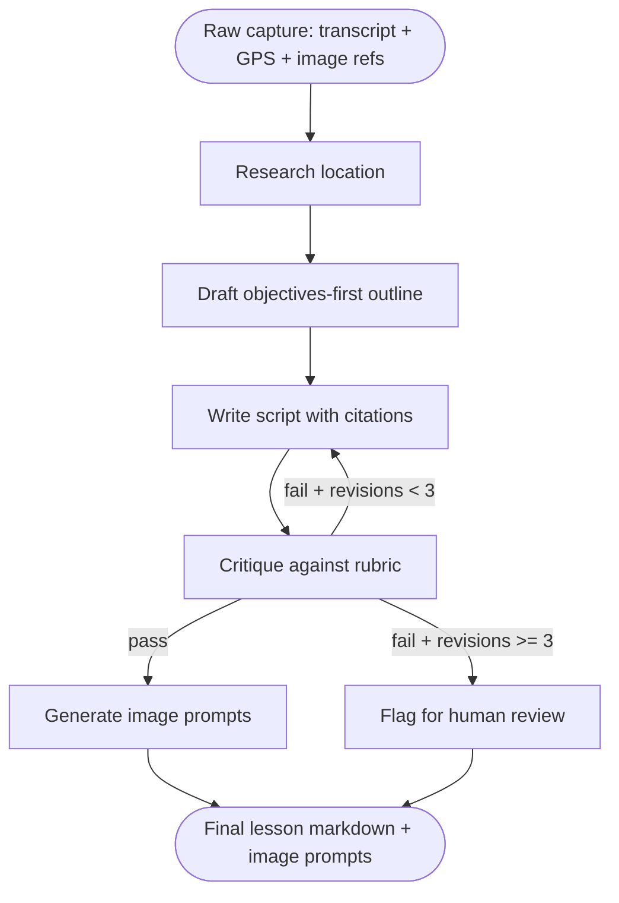

# Wanderlearn Field Reporter

A LangGraph agent with a reflection loop. Drops a raw location capture (transcript + GPS + photo metadata) in. Pulls out a publishable lesson with citations. Self-critiques against a rubric and revises until it passes, or hits the max-revision ceiling.

[]() <!-- replace with real CI badge -->
[](LICENSE)
[]()
[]()
[](https://smith.langchain.com)

---

## TL;DR

Most agents run once and call it done. This one critiques its own output and revises until it passes.

The agent researches the location with a web search tool, drafts an objectives-first lesson outline, writes a script with citations, then evaluates the draft against a configurable rubric. If the rubric fails, it loops back to the writer with feedback. If it passes, it generates image prompts and exits. If it hits the max revision count without passing, it flags the run for human review.

This repo demonstrates three LangGraph patterns: reflection loops, rubric-as-eval, and bounded cyclic graphs.

Companion 4-lesson course (Module 3 of the series): [livelongworkfree.com/course/reflection](https://livelongworkfree.com/course/reflection)
Companion podcast (S1E2, coming after S1E1): [livelongworkfree.com/podcast](https://livelongworkfree.com/podcast)
Sister projects in the same curriculum: [Triage Agent](https://github.com/dapperAuteur/witus-triage-agent), [Multi-Agent Coach](https://github.com/dapperAuteur/centenarian-coach-multiagent)

---

## The problem

Wanderlearn captures 360° photo, 360° video, and drone footage at real locations. Every course is anchored to a place. The flagship capture is the MUCHO Museo del Chocolate in Mexico City. The next planned shoot is Ghana.

Turning raw captures into lessons is slow manual work. Research the location. Outline objectives. Write the script. Fact-check. Format. Hours per lesson. It is the bottleneck on course velocity, full stop.

This agent automates the drafting half. It does not publish anything on its own (the operator still reviews the final markdown before it goes live), but it produces a high-quality draft on the first or second pass. The fixture in this repo is the MUCHO capture; swap in your own location data and the agent works the same way.

---

## Architecture



The edge from `CRITIQUE` back to `WRITE` is the reflection loop. Termination is rubric pass OR max-revisions hit. The graph is cyclic but bounded.

---

## The three patterns

This repo demonstrates three LangGraph patterns. Each has a companion lesson under `/docs/lessons/`.

### 1. Reflection loops

The agent reads its own draft, scores it against a rubric, and revises. The cyclic graph in LangGraph makes this expressible in maybe 30 lines, but the pattern is what most "AI agent" demos skip.

```ts
graph.addConditionalEdges('critique', (state) => {
  if (state.critique?.passed) return 'imagePrompts';
  if (state.draft.revisionNumber >= MAX_REVISIONS) return 'flagForHumanReview';
  return 'write'; // loop back
});
```

The pass/fail signal comes from the structured output of the critic node, not from a vague LLM "yes/no." Lesson 1 walks through why structured pass/fail decisions are the difference between a stable loop and an infinite one.

Full graph: [`src/agent/graph.ts`](./src/agent/graph.ts)

### 2. Rubric as eval

The rubric lives in a single TypeScript file. The critic reads it. The LangSmith eval reads it. The README references it. One source of truth.

```ts
export const rubric: RubricDefinition = {
  has_clear_objectives: {
    description: '3 to 5 learning objectives listed at the top of the lesson.',
    weight: 1,
  },
  sections_tie_to_objectives: {
    description: 'Each section references at least one numbered learning objective.',
    weight: 1,
  },
  has_three_citations: {
    description: 'At least 3 distinct, named sources cited in the body.',
    weight: 1,
  },
  has_hands_on_exercise: {
    description: 'Includes at least one exercise the learner does on their own.',
    weight: 1,
  },
  reading_level_matches_audience: {
    description: 'Reading level appropriate for the targetAudience field.',
    weight: 1,
  },
  has_next_capture_appendix: {
    description: 'Ends with "what to capture next time" so the operator improves field shoots over time.',
    weight: 0.5,
  },
};
```

Editing the rubric is editing one file. No prompt rewrites, no graph changes. Lesson 2 covers how to write rubric criteria an LLM can actually score.

Full rubric: [`src/agent/rubric.ts`](./src/agent/rubric.ts)

### 3. Bounded cyclic graphs

A loop that cannot terminate is a bug, not a feature. The max-revision count is a constant exported from `graph.ts`. The counter lives on state, not in a prompt. The model is never asked to count its own iterations.

```ts
export const MAX_REVISIONS = 3;
```

When the counter hits the ceiling, the run exits gracefully via the `flagForHumanReview` node. The operator gets a queue entry with the last draft, the last critique, and a note that the rubric never passed in the allowed budget. Lesson 4 covers termination patterns and cost control.

---

## Quick start

You need Node 20+, a Postgres database (Neon free tier works), an Anthropic API key, a Tavily API key (for web search; free tier is 1,000 searches/month), and a LangSmith account.

```bash
# 1. Clone
git clone https://github.com/dapperAuteur/wanderlearn-field-reporter.git
cd wanderlearn-field-reporter

# 2. Install
pnpm install

# 3. Configure
cp .env.example .env
# Fill in ANTHROPIC_API_KEY, TAVILY_API_KEY, DATABASE_URL,
# LANGSMITH_API_KEY

# 4. Migrate
pnpm db:migrate

# 5. Run the dev server
pnpm dev
```

Open `http://localhost:3000/field-report/new`, paste the MUCHO Museo del Chocolate fixture from `tests/fixtures/mucho-capture.json`, and click Generate. The agent will run through research, outline, write, critique, and (probably) one revision before passing the rubric and outputting a final lesson.

Watch the trace in LangSmith to see the loop happen. The revision viewer at `/field-report/[id]` lets you scrub between revisions side-by-side.

If clone-to-first-lesson takes longer than 20 minutes, that is a bug. Open an issue.

---

## What you can learn from this repo

Four lessons under `/docs/lessons/`. Each is ~1,200 words plus inline code.

- [Lesson 1: Reflection Loops](./docs/lessons/01-reflection-loops.md). Why an agent that critiques itself outperforms an agent that does not.
- [Lesson 2: Writing Rubrics](./docs/lessons/02-writing-rubrics.md). Rubric criteria an LLM can actually score, with concrete evidence requirements.
- [Lesson 3: LangSmith Evals](./docs/lessons/03-langsmith-evals.md). Turning your rubric into a CI-runnable eval.
- [Lesson 4: Termination](./docs/lessons/04-termination.md). Bounded cyclic graphs, max-iteration counters, and graceful exits.

Lessons use a different sample domain (drafting blog posts from interview notes) so the pattern transfers cleanly.

---

## Tech stack

| Layer            | Choice                                      |
|------------------|---------------------------------------------|
| Runtime          | Node 20+, Next.js 16                        |
| Language         | TypeScript strict                           |
| Agent framework  | `@langchain/langgraph` ^0.2                 |
| LLM SDK          | `@langchain/anthropic`                      |
| Models           | Sonnet 4.6 (writer + critic), Haiku 4.5 (research + image prompts) |
| Web search       | Tavily via `@langchain/community`           |
| Storage          | Cloudinary (for capture image metadata)     |
| Database         | Postgres (Neon)                             |
| ORM              | Drizzle                                     |
| Observability    | LangSmith                                   |
| UI               | Tailwind v4, shadcn/ui                      |
| Testing          | Vitest                                      |

For a Gemini-stack version, see Appendix A in the PRD. Reflection loops are the highest-leverage swap of the three projects in this series because the loop multiplies LLM calls: Gemini Flash on the cheap nodes and Pro on the critic gives roughly 3x cost savings without sacrificing rubric adherence (if the critic is on Pro, not Flash).

---

## Project structure

```
wanderlearn-field-reporter/
├── README.md                       <- you are here
├── docs/
│   └── lessons/                    <- 4 companion lessons
├── src/
│   ├── agent/
│   │   ├── graph.ts                <- the LangGraph state machine
│   │   ├── state.ts                <- typed state object
│   │   ├── rubric.ts               <- single source of truth for "good"
│   │   ├── nodes/
│   │   │   ├── research.ts
│   │   │   ├── outline.ts
│   │   │   ├── write.ts
│   │   │   ├── critique.ts
│   │   │   ├── generateImagePrompts.ts
│   │   │   └── flagForHumanReview.ts
│   │   └── tools/
│   │       ├── webSearch.ts
│   │       ├── cloudinaryMetadata.ts
│   │       └── existingWanderlearnCourses.ts
│   ├── app/
│   │   ├── api/field-report/       <- REST routes
│   │   └── field-report/
│   │       ├── new/                <- intake form
│   │       └── [id]/               <- side-by-side revision viewer
│   ├── db/
│   │   └── schema.ts
│   └── lib/
│       ├── langsmith.ts
│       └── cloudinary.ts
├── tests/
│   ├── agent/
│   │   ├── critique.test.ts        <- pass/fail decision tests
│   │   └── termination.test.ts     <- max-revisions enforcement
│   └── fixtures/
│       └── mucho-capture.json      <- the real MUCHO Museo del Chocolate input
└── package.json
```

---

## Configuration

```env
ANTHROPIC_API_KEY=
TAVILY_API_KEY=                  # https://tavily.com (free tier is enough)
LANGSMITH_API_KEY=
LANGSMITH_PROJECT=wanderlearn-field-reporter
LANGSMITH_TRACING=true
DATABASE_URL=postgres://...
CLOUDINARY_URL=                  # optional, only if you wire real captures
NEXTAUTH_SECRET=
NEXTAUTH_URL=http://localhost:3000
```

The web search tool is capped at 5 calls per agent run (enforced as a node-level guard, not as a prompt instruction). The 1,000 Tavily searches per month free tier covers 200+ runs comfortably.

---

## Testing

```bash
pnpm test                  # all tests
pnpm test:critique         # 5 hand-graded drafts (2 pass, 3 fail); must score 5/5
pnpm test:termination      # max-revisions enforcement
pnpm test:integration      # full graph on the MUCHO fixture
```

The `test:critique` target is the gate. The critic must correctly grade 5 hand-graded drafts (2 that should pass, 3 that should fail) before the cyclic loop is allowed to run in production. If a release breaks this test, the loop is disabled until the critic is fixed.

---

## LangSmith trace

Every field report writes a trace. The trace shows:
- The research node's web search calls.
- The outline node's structured output (objectives + section map).
- Each `write` invocation as a separate run.
- Each `critique` invocation with the rubric scores.
- The conditional edge decision (pass / loop / flag).

For a representative trace showing revision 1 failing and revision 2 passing, see the pinned run in the LangSmith project view.

---

## A real bug I caught

The first time I ran the agent against the MUCHO fixture, the critic looped four times and ran out of budget. Every revision was missing the same criterion (`has_next_capture_appendix`), and the writer kept producing drafts without the appendix even after the critic flagged it.

Reading the LangSmith trace showed the writer was getting the rubric feedback as one big blob of text, and the appendix requirement was buried in the middle. The fix was structuring the feedback as a list of specific criteria the draft had failed, plus the suggestion from the rubric for how to fix each one. After the fix, MUCHO passed on revision 2 with the appendix in place.

Lesson 1 walks through this in detail.

---

## Roadmap

This repo ships v1. Visible roadmap:

- [ ] v1.1: Multi-language output (Spanish first; MUCHO is in Mexico City).
- [ ] v1.2: Auto-publish path that posts to Wanderlearn after operator approval.
- [ ] v2: Image generation for the prompts the agent produces.
- [ ] v2.1: Audio script timing notes for narrated lessons.
- [ ] v3: Multi-agent variant where research + writing + critique are separate specialists with their own retrieval namespaces.

Track progress in [Issues](./issues). PRs not currently accepted; this is a portfolio + course project.

---

## Related work

- **Triage Agent (single-agent, human-in-the-loop):** [github.com/dapperAuteur/witus-triage-agent](https://github.com/dapperAuteur/witus-triage-agent)
- **Multi-Agent Coach (supervisor + specialists):** [github.com/dapperAuteur/centenarian-coach-multiagent](https://github.com/dapperAuteur/centenarian-coach-multiagent)
- **Honest model comparison:** [Gemini vs Claude SWOT](https://brandanthonymcdonald.com/blog/gemini-vs-claude-swot)
- **Podcast:** [Live Long. Work Free.](https://livelongworkfree.com/podcast)
- **4-lesson sister course (triage agent):** [livelongworkfree.com/course/triage](https://livelongworkfree.com/course/triage)
- **5-lesson sister course (multi-agent):** [livelongworkfree.com/course/multi-agent](https://livelongworkfree.com/course/multi-agent)
- **4-lesson course for this repo:** [livelongworkfree.com/course/reflection](https://livelongworkfree.com/course/reflection)

The three repos together cover the three patterns that show up most in production agent engineering: human-in-the-loop interrupts (Triage), supervisor routing (Coach), and reflection loops (this repo). Together they are a complete curriculum.

---

## Why this exists

Wanderlearn is a place-based learning platform I built. Every course is tied to a real location. The bottleneck on course velocity was not the shoot (drones and 360° rigs are cheap and fast now); it was turning raw captures into publishable lessons. Hours of research and drafting per lesson, every time.

This agent collapses that work into a 5 to 10 minute first pass. The reflection loop is what makes the first pass good enough to ship after a single operator review. Without the loop, I had a writer with no editor. The loop is the editor.

If you are building any content pipeline where quality matters more than speed and where you can write a checklist for "good," the reflection loop pattern is what you eventually arrive at. The four lessons in `/docs/lessons/` are how I would have wanted to learn this six months ago.

---

## About the author

Brand Anthony McDonald. Solo builder. Operator of the WitUS ecosystem. Trained actor, working educator, sometimes a broadcast-team contractor at the Indianapolis Motor Speedway. Based in Indianapolis.

- Blog: [brandanthonymcdonald.com](https://brandanthonymcdonald.com)
- Podcast: [livelongworkfree.com](https://livelongworkfree.com)
- LinkedIn: [linkedin.com/in/brandanthonymcdonald](https://linkedin.com/in/brandanthonymcdonald)
- Email: a@awews.com

If you are hiring for Developer Relations, Education Engineering, or Solutions Engineering and you have read this far, this repo is what my day-to-day work looks like. Reach out.

---

## License

MIT. See [LICENSE](./LICENSE).

Fork it. Ship it. Teach from it. Attribution appreciated, not required.
